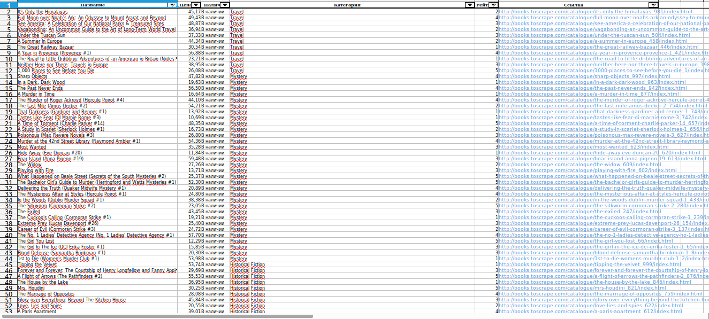

# Shop Parser — выгрузка каталога интернет-магазина в Excel

Скрипт на Python обходит каталог магазина (категории, много страниц в каждой) и сохраняет товары в Excel: название, цена, наличие, категория, рейтинг, ссылка на карточку.

Демо работает на учебном сайте [books.toscrape.com](http://books.toscrape.com/), который создан для тренировки парсеров: сбор данных там разрешён, юридических вопросов нет. Результат прогона по всему каталогу — 1000 товаров из 50 категорий — лежит в [`output/books.xlsx`](output/books.xlsx).

## Что получает заказчик

Вы даёте ссылку на каталог и список нужных полей. Получаете:

- файл Excel с данными (при необходимости CSV);
- скрипт, который можно запускать повторно, когда каталог обновится;
- короткую инструкцию по запуску;
- отчёт о прогоне: сколько товаров собрано, были ли ошибки, какие категории собраны не полностью.

## Пример результата



Что в файле:

| Колонка | Пример |
|---|---|
| Название | It's Only the Himalayas |
| Цена, £ | 45.17 (число, а не текст — работают сортировка и суммы) |
| Наличие | В наличии |
| Категория | Travel |
| Рейтинг | 2 (от 1 до 5) |
| Ссылка | кликабельная ссылка на карточку товара |

В файле включён автофильтр, строка заголовка закреплена, ширина колонок подобрана.

## Что я проверяю перед началом на реальном сайте

Демо-сайт устроен просто. Настоящие магазины бывают сложнее, поэтому до старта работы смотрю на несколько вещей и сообщаю результат заранее:

- **Как загружаются данные.** Если товары подгружаются через JavaScript, сначала ищу, нет ли у сайта API или JSON, из которого он берёт данные. Это проще и надёжнее, чем разбор вёрстки.
- **Защита от автоматического доступа.** Если она есть, говорю об этом до начала работы: срок и возможность выполнения в таком случае оцениваются отдельно.
- **Правила сайта.** Смотрю `robots.txt` и условия использования. Работаю с открытыми данными каталога; если данные закрыты авторизацией или содержат персональную информацию, обсуждаем отдельно.
- **Объём.** Считаю количество страниц и товаров, чтобы честно назвать срок и нагрузку на сайт.

## Как проверялось

Результат сверялся, а не принимался на веру:

- число строк в Excel (1000) совпадает с числом товаров, которое показывает сайт;
- дублей по ссылке нет;
- одно совпадение по названию («The Star-Touched Queen») — это два разных товара с разной ценой и страницей, поэтому дедупликация идёт по ссылке, а не по названию;
- все 1000 цен распознаны как числа, диапазон £10.00–£59.99;
- цена, рейтинг, наличие и ссылка вручную сверены с сайтом на нескольких случайных товарах из разных категорий.

## Устойчивость и аккуратность по отношению к сайту

- **Пауза между запросами** (`--delay`, по умолчанию 0.75 с), чтобы не создавать лишнюю нагрузку. Значение подбирается под конкретный сайт.
- **Честный User-Agent**: запросы представляются как парсер со ссылкой на этот репозиторий, а не маскируются под обычный браузер.
- **Повторные попытки** при обрыве соединения, таймауте, ошибке 5xx или 429 — до 3 раз с паузой. Ошибки 4xx (например, 404) не повторяются.
- **Если страница так и не загрузилась**, категория помечается как неполная. В итоговом отчёте видно, где и до какой страницы данные собраны, а скрипт завершается с кодом 1, чтобы сбой не остался незамеченным.
- **Отсутствующие поля** на карточке не роняют скрипт: подставляется «не указано».
- **Понятные сообщения об ошибках** вместо трейсбека Python: сайт недоступен, категория не найдена (с перечнем доступных).

## Запуск

```bash
python3 -m venv .venv
source .venv/bin/activate      # Windows: .venv\Scripts\activate
pip install -r requirements.txt
```

```bash
# Весь каталог
python parser.py

# Одна категория
python parser.py --category "Travel" --output output/travel.xlsx

# Своя задержка между запросами
python parser.py --category "Mystery" --delay 1.0
```

Параметры:

- `--category` — название категории (например, `Travel`). Без параметра обрабатываются все категории.
- `--output` — путь к результату (по умолчанию `output/books.xlsx`).
- `--delay` — задержка между запросами в секундах (по умолчанию `0.75`).

Пример вывода при полном прогоне:

```
Подключаюсь к http://books.toscrape.com/ ...
Категорий к обработке: 50

  [Travel] страница 1: http://books.toscrape.com/catalogue/category/books/travel_2/index.html
  [Travel] собрано товаров: 11

  [Mystery] страница 1: http://books.toscrape.com/catalogue/category/books/mystery_3/index.html
  [Mystery] страница 2: http://books.toscrape.com/catalogue/category/books/mystery_3/page-2.html
  [Mystery] собрано товаров: 32

  ... (ещё 48 категорий) ...

=== Итоговая статистика ===
Категорий обработано: 50
Товаров собрано: 1000
Неполных категорий: 0
Результат сохранён в: output/books.xlsx
```

## Как устроен код

Простой процедурный код, каждая функция отвечает за один шаг: `get_page()` (загрузка с ретраями), `get_categories()`, `get_next_page_url()`, `parse_product_card()`, `scrape_category()`, `save_to_excel()`.

## Ограничения

Это демонстрационный проект под один тип задачи: каталог с категориями и пагинацией. Это не универсальный парсер для любых сайтов.

- Селекторы (`article.product_pod`, `p.price_color` и т.д.) под реальный магазин нужно адаптировать к его вёрстке.
- Собираются данные со страниц списка. Данные из карточки товара (описание, артикул, характеристики, картинки) требуют отдельного обхода: это возможно, но увеличивает объём запросов и время работы.
- Результат записывается в файл в конце прогона. Для очень больших каталогов (десятки тысяч товаров) нужна докачка после сбоя, в демо её нет.

## Стек

Python 3, requests, BeautifulSoup4, pandas, openpyxl, argparse.

## Контакты

Заказать парсинг каталога или обсудить задачу:

- Kwork: _ссылка на профиль_
- Сайт: _ссылка_
